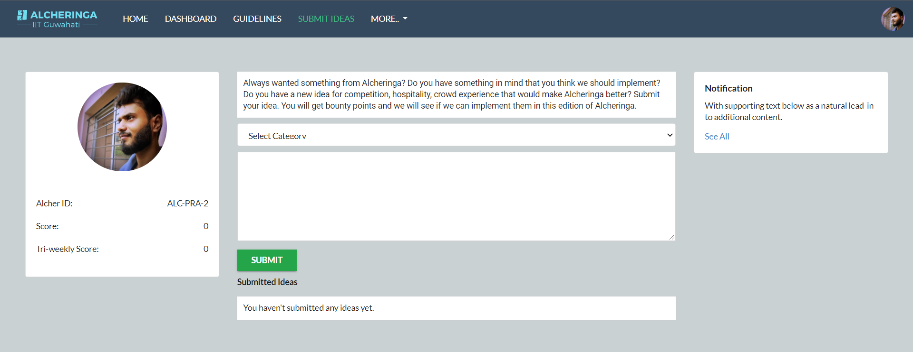
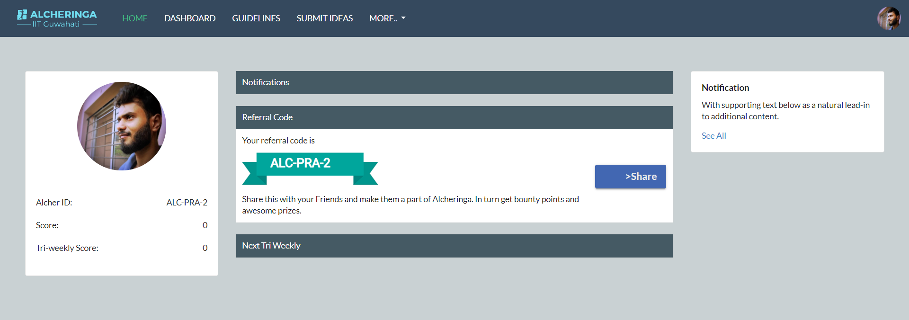

# Alcheringa CA Portal

This Portal is used to appoint representatives from other colleges to maintain Alcheringa’s brand presence among those colleges and universities. 

## TODO

* Facebook integration.
* Notifications

## Screenshots





## Installation
* Clone the repo
* Setup a virtual environment (install virtual environment from ```pip install virtualenv==16.7.9```)
* Run 
```
pip install -r "ca/requirements.txt"
python manage.py makemigrations
python manage.py migrate
python manage.py runserver
```

